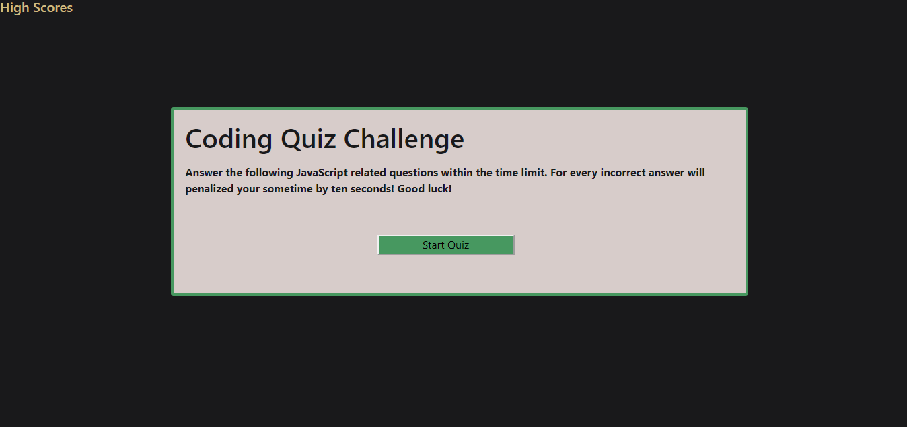

# web_APIs_Homework_4

## Function 

After selecting the Start button, the timer function starts and javascript loads the first question. Selecting any of the li elements will return a correct or a sorry that is not correct answer. From there you will press next. This then continues for the next five questions. If the timer runs out of time, the game will end loading the 'game Over' gif. If you finish the game through its entirety, you will land on a HighScore page. After clicking next, the game will then reset itself. 

## Intended Use

This quiz is intended to further cement th use of JavaScript and navigating the DOM. Here I am able to show the various create, append, attribute functions throughout this file. 

## Credit
The game over gif comes from https://www.behance.net/gallery/62430007/Various-Animated-Gifs and was created by Murat Kalkavan

## Link to Deployed Product

https://mnorthup2207.github.io/web_APIs_Homework_4/
